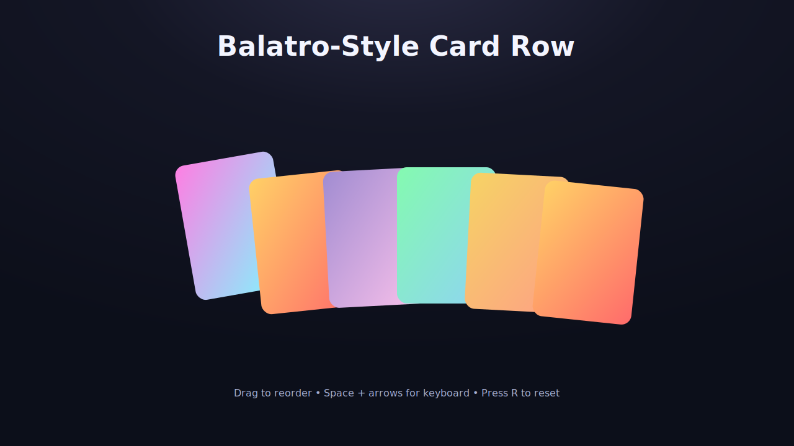

# Balatro‑Style Card Row (React + TS)

A slick, animated row of cards inspired by Balatro’s feel: colorful gradients, gentle overlap, springy drag‑and‑drop reordering, curved layout, and a11y‑friendly keyboard controls. Includes a secondary ingredient‑themed deck with icons and a dark/light theme toggle.

## Highlights

- Fluid drag + spring animations via `framer-motion` and `@dnd-kit`
- Curved layout with subtle rotation; proximity “push” while dragging
- Responsive overlap and density; cards lift, tilt, and glow on hover
- Keyboard sorting: Space to pick up, arrows to move, Enter/Space to drop, Esc to cancel
- A11y: live announcements for pick up, move, and cancel; helpful instructions
- Theme + deck toggles (Dark/Light, Letters A–J / Ingredients with icons)
- Quick reset shortcut: press `R` to restore the order

## Tech Stack

- React 18 + TypeScript
- Vite + @vitejs/plugin-react
- framer-motion, @dnd-kit/core, @dnd-kit/sortable

## Getting Started

- Install: `npm install`
- Dev: `npm run dev` (open the printed localhost URL)
- Build: `npm run build`
- Preview: `npm run preview`

## Controls

- Mouse: click + drag to reorder
- Keyboard: focus a card
  - Space: pick up / drop
  - ←/→: move while holding a card
  - Enter: drop
  - Esc: cancel
- Shortcut: `R` resets current deck order

## Customize

- Curve strength: tweak `computeCurve()` in `src/components/CardRow.tsx`
- Push effect: tune `radius` and `maxPush` in `DndEffects.onDragMove`
- Overlap density: adjust `overlapClamp` in `CardRow.tsx`
- Decks: edit in `src/App.tsx` (letters and ingredients demo included)
- Card visuals: edit gradients and SVG icons in `src/assets/ingredients/`

## Project Structure

- `src/components/CardRow.tsx` — the main component (layout, drag, animations)
- `src/App.tsx` — demo shell, theme/deck toggles
- `src/index.css` — base styles + theme polish
- `src/assets/ingredients/` — simple SVG artwork for the ingredient deck

---

This repo is a small reference for combining `@dnd-kit` and `framer-motion` to create tactile, game‑like UI motion while keeping accessibility in mind. Have fun remixing it!

